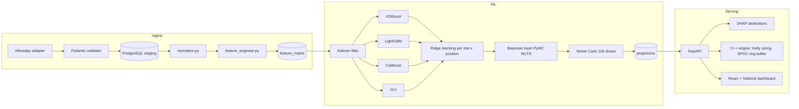

# Gridiron Oracle

> An NFL player-projection platform with a low-latency C++ execution engine — built to be evaluated honestly, not to look impressive.

## Evaluation first

Before changing models or promoting a run, answer these in order:

1. **Causal?** Both prediction and baseline use only prior information (`require_causal_projections`, OOF or `max_train_season`).
2. **Beat naive + trailing-3?** `python -m ml.eval_causal` / `make diagnose-backtest` on `fantasy_ppr` (and volume targets).
3. **Draft-rank diagnostics?** `python -m ml.adp_eval --season YYYY` reports causal preseason ranks alongside actuals-oracle and prior-season gaps. It does not claim to “beat ADP.”
4. **Feature groups?** Phase 4 groups stay off `FEATURE_COLS` until `python -m ml.feature_groups --group …` shows a held-out MAE win.
5. **Model floor?** Stack layers only where they beat `python -m ml.model_floor`.
6. **Promote?** `python scripts/reprojection_gate.py` then `make freeze-baseline` with `PRODUCT_MODE=artifact_backed`.

Draft board UI: `/draft` (API `/draft/board`). ADP CSVs live under `data/adp/historical/` (Fantasy Football Calculator; see `PROVENANCE.md`).

For a new draft season, import a licensed FantasyPros CSV or public Sleeper draft aggregate, then materialize a dated projection run:

```bash
python -m scraper.adapters.fantasypros_adp_importer --season 2026 --path data/adp/fantasypros/ppr_2026.csv
python scripts/materialize_preseason_draft_projections.py --season 2026 --as-of 2026-08-01
python scripts/regenerate_adp_diagnostics.py --seasons 2022 2023 2024 2025 2026
```

The import records every unresolved player in `adp_player_matches`; it never falls back to matching names at serving time.

Gridiron Oracle ingests multi-source NFL data, tracks latent player ability with a Kalman filter, ensembles four base learners under a Bayesian uncertainty layer, validates with walk-forward backtesting, and feeds sized signals into a lock-free C++ engine.

The design principle throughout is that **the evaluation is the product.** Anyone can stack four models. The interesting question is whether the result beats a naive baseline — and this repository is set up to answer that question rather than avoid it.

---

## Model status — read this before anything else

**The weekly stack has demonstrated edge versus naive and trailing-3 baselines.** Do not cite `reports/yardage_diagnostic.json` (60 rows, one season, `temporal_ordered: false`, no features) as a product result; that file is quarantined.

Live causal OOF (15 cells × seasons 2021–2025):

| Result | Value |
|---|---|
| Cell-seasons beating both naive and trailing-3 | **74 / 75** |
| Typical MAE vs trailing-3 (yardage / PPR) | ~7% better |
| Serving vs OOF | bit-exact on 80,404 rows |

Five of the 15 served cells are **LGBM identity**, not a 4-learner Ridge stack. The gate vs same-day bootstrap cannot fail on those cells. Disclosed in `releases/candidates/causal_20260810/CONSTRAINED_STACK_SELECTION.json`:

- `fantasy_ppr` / QB
- `fantasy_ppr` / WR
- `passing_yards` / QB
- `receiving_yards` / WR
- `rushing_yards` / QB

Season / rest-of-season endpoints are **fail-closed** until playing-time (SP2). Draft ranks use 8-team PPR VOR (K/DST out of scope). Contemporaneous xFP is a leak and is forbidden as a model input.

The next scoreboard check is Marcel (prior-season rates, shrunk to position mean) versus this stack. If the stack cannot beat Marcel, the program reframes.

---

## Architecture



Each layer is chosen because it is the statistically correct tool for its sub-problem, not because it is fashionable:

- **Kalman filter for player form.** Player ability is a latent state observed with noise. A rolling average is a crude, lagging estimator of the same thing; a scalar Kalman filter per (player, stat) is the right one, and it is causal by construction.
- **Four base learners, stacked per (stat, position).** A meta-learner learns when to trust each base model. Stacking across positions produces biased intercepts — combining QB, WR, RB, and TE for passing yards drove the intercept to −9.05 — so every (stat, position) pair gets its own Ridge.
- **Bayesian layer for uncertainty.** A point projection is not useful for sizing a position. PyMC NUTS with a Kalman-informed prior produces the distribution that Monte Carlo then samples.
- **Walk-forward validation only.** Random k-fold on time-series data leaks the future into the past and manufactures edge that does not exist.
- **C++ for execution.** A lock-free SPSC ring buffer with documented memory orderings, fractional Kelly sizing, and zero heap allocation in the hot path.

Full detail in [`docs/ARCHITECTURE.md`](docs/ARCHITECTURE.md).

## Quick start

```bash
make setup
make up
```

| Surface | URL |
|---|---|
| FastAPI docs | http://localhost:18017/docs |
| Frontend SPA | http://localhost:15173 |
| MLflow | http://localhost:15091 |
| Jaeger | http://localhost:18686 |

Local development:

```bash
make bootstrap-local     # canonical local environment
make verify-local        # offline Python tests + frontend + engine checks
make diagnose-backtest   # current edge by stat and position
make yardage-diagnostic  # the yardage evaluation reported above
```

## Runtime modes

`PRODUCT_MODE` controls whether the API is allowed to serve anything that is not backed by a real model artifact.

| Mode | Meaning |
|---|---|
| `artifact_backed` | **Production default intent.** API relies on real model artifacts + `releases/current_baseline.json`. Nothing synthetic is served. Set `PRODUCT_MODE=artifact_backed`, `BASELINE_MANIFEST_PATH=releases/current_baseline.json`, `ARTIFACT_INVALIDATION_PATH=releases/artifact_invalidations.json`. |
| `graceful_fallback` | Fallback paths are permitted, and the API and UI **must** label synthetic outputs explicitly. Local default until a baseline is frozen. |

`/health` exposes a readiness summary; `/integrity` exposes the detailed operational report used for release checks.

Freeze / gate:

```bash
python scripts/reprojection_gate.py --holdout-season 2024 --position WR --target fantasy_ppr
make freeze-baseline   # writes releases/current_baseline.json
```

## The evidence pipeline

A run is only promotable if it went through this path. The ordering is the point — each step exists to prevent a specific way of fooling yourself.

```bash
export PRODUCT_MODE=artifact_backed
bash pipeline/run_full_etl.sh
make verify-artifact-prerequisites
bash ml/train_all_models.sh          # ~30-40h full; --resume after a crash
make verify-readiness
make freeze-baseline                 # refuses blocked runtimes by default
```

Every base learner writes a training manifest under `ml/oof/manifests/`; stacking writes a per-(stat, position) promotion decision. Only after a market-aware backtest **and** `make verify-readiness` are green should a baseline be frozen.

`make ingest` is the fast core-ETL command for development. It is not a substitute for the full evidence pipeline.

When a historical run or cohort is known bad, record it rather than deleting it:

```bash
.venv_311/bin/python scripts/invalidate_artifacts.py \
  --pipeline-run-id <run_id> --reason "legacy contamination"
```

## Repository layout

```
scraper/adapters/      One adapter per data source (nflreadpy is primary)
pipeline/              normalize · feature_engineer · orchestrator
ml/                    kalman_tracker · xgb/lgbm/catboost/tft models ·
                       stacking_ensemble · bayesian_model · monte_carlo ·
                       backtest · shap_service · train
engine/                C++ — ring_buffer, kelly_sizer, exposure_manager,
                       signal_processor, ws_consumer
backend/app/           FastAPI — api, core, models, services
frontend/src/          React + TypeScript strict + Tailwind
infra/                 docker-compose: Postgres, MLflow, Jaeger, OTel,
                       Prometheus, Alertmanager
reports/               Evaluation diagnostics
```

## Testing

```bash
make test              # pytest + Catch2
make ci                # test + typecheck + lint
make bench             # C++ benchmarks — ring buffer target < 200 ns/op
make mutmut            # mutation testing
```

Integration and network tests are marker-isolated; the default CI path is offline-only.

**On Apple Silicon**, export these before running any ML code or pytest:

```bash
export KMP_DUPLICATE_LIB_OK=TRUE
export OMP_NUM_THREADS=1
```

The crash they prevent is real — but they are broader than it needs to be, and
`OMP_NUM_THREADS=1` costs multi-core gradient-boosting training.
`scripts/verify_openmp_runtime.py` measures the actual condition on your host and
writes `reports/openmp_runtime.json`. Measured here on 2026-08-19:

- Three **distinct** `libomp.dylib` binaries are reachable: Homebrew's (used by
  XGBoost and LightGBM), scikit-learn's bundled copy, and PyTorch's.
- Only the **PyTorch** pairing crashes. LightGBM or XGBoost multithreaded with
  `torch` imported dies with SIGSEGV; without `torch` both run multithreaded
  cleanly and do not even need `KMP_DUPLICATE_LIB_OK`.
- Threading is worth having: 9.2 s → 3.6 s (**2.6×**) on a 100k × 80 benchmark.

`ml/lgbm_model` does not import `torch`, so `ml/train_all_models.sh` now runs the
LightGBM stage under `GBDT_OMP_THREADS` (default: half the cores) while leaving
`OMP_NUM_THREADS=1` in force for the TFT stage. CatBoost is deliberately left
alone: it ignores `OMP_NUM_THREADS` and was already using every core. Expect well
under 2.6× in practice — LightGBM shares the machine with the concurrent CatBoost
stage. Set `GBDT_OMP_THREADS=1` to revert. A conda-forge/pixi environment with a
single unified `llvm-openmp` would remove the constraint everywhere, including
for `torch`; that migration has not been done.

## Documentation

| Document | Contents |
|---|---|
| [`docs/ARCHITECTURE.md`](docs/ARCHITECTURE.md) | Layer-by-layer design and the decisions log |
| [`PIPELINE_RUNBOOK.md`](PIPELINE_RUNBOOK.md) | Operating the ETL and training pipeline |
| [`docs/PIPELINE_WALKTHROUGH.md`](docs/PIPELINE_WALKTHROUGH.md) | End-to-end walkthrough |
| [`docs/TFT_OOF_ANALYSIS.md`](docs/TFT_OOF_ANALYSIS.md) | Temporal Fusion Transformer out-of-fold analysis |
| [`CONTRIBUTING.md`](CONTRIBUTING.md) | Contribution workflow |
| [`CHANGELOG.md`](CHANGELOG.md) | Release history |
| [`SECURITY.md`](SECURITY.md) | How to report vulnerabilities |

## License

This project is licensed under the [PolyForm Noncommercial License 1.0.0](LICENSE). You may use it for personal, research, educational, and other noncommercial purposes. **Any commercial, corporate, or monetary use requires a separate license** — contact [bhardw30@purdue.edu](mailto:bhardw30@purdue.edu).
